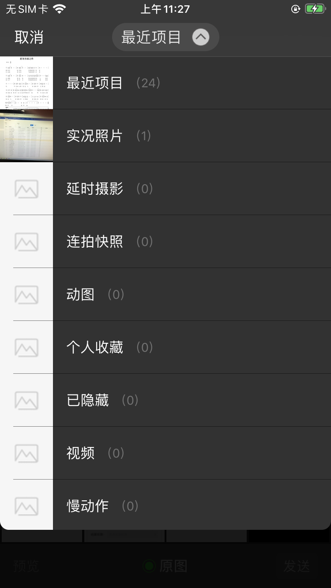
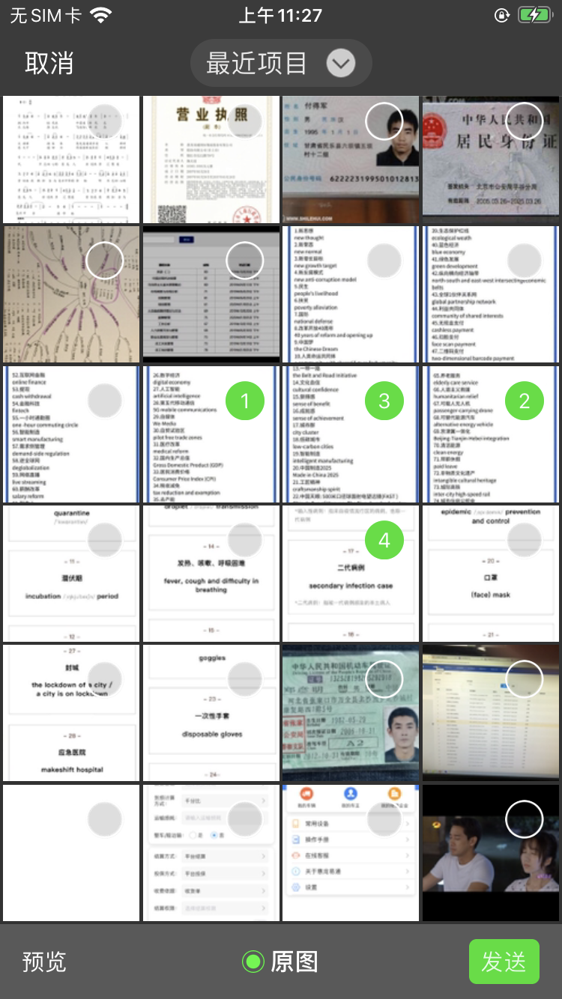
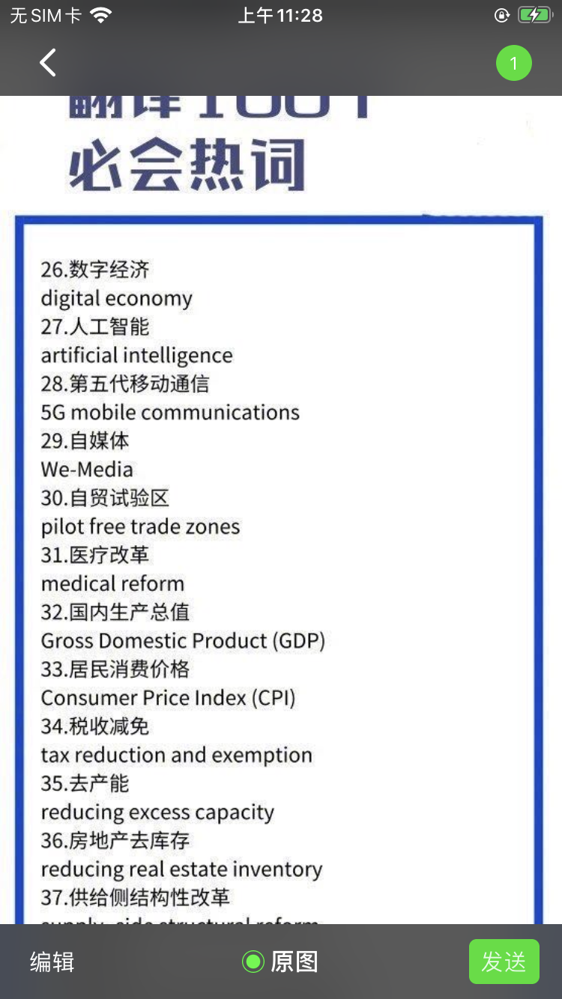
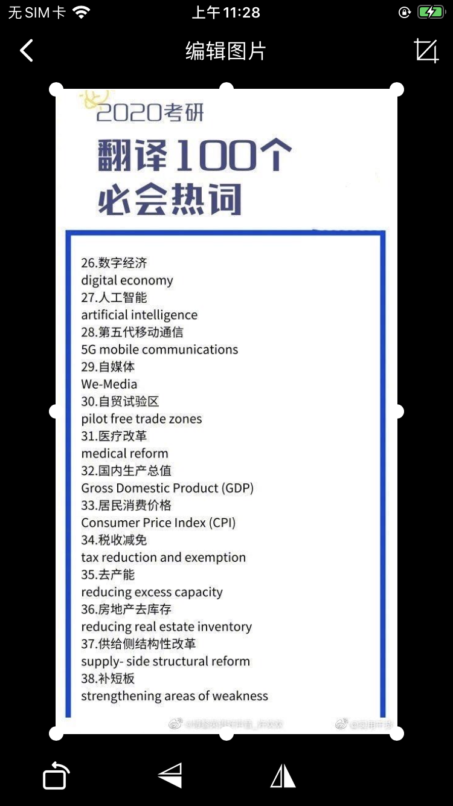

# SRAlbum
*自定义相册，图片编辑，相册获取方式有照片和视频混合获取，照片获取，视频获取，照相和录像功能，有矩形卡片检测功能，自动截取矩形卡片。

# 安装方法
    在Podfile中添加 pod 'SRAlbum','~> 0.1.3'
    然后使用 pod install 命令
    
# Info.plist需要添加：
    Privacy - Photo Library Usage Description
    Privacy - Camera Usage Description
    Privacy - Microphone Usage Description
    Prevent limited photos access alert 这个设置为YES
    

# swift使用方法
    导入模块：import SRAlbum
    
    相册使用：
    调用方法1：
    SRAlbumWrapper.openAlbum(tager: self, maxCount: 5, isEidt: true, isSort: true) { (assets) in
        print("assets")
    }
    调用方法2：
    self.openAlbum( maxCount: 5, isEidt: true, isSort: true) { [weak self](assets) in
        print("assets")
    }
    
    相机使用：
    调用方法1：
    SRAlbumWrapper.openCamera(tager: self, cameraType: .Photo, isRectangleDetection: false, isEidt: true, maxSize: 2*1024*1024) { (img:UIImage?, url:URL?) in
        
    }
    调用方法2：
    self.openCamera(cameraType: .Photo, isRectangleDetection: true, isEidt: true) { [weak self](img:UIImage?, url:URL?) in
    
    }
    
    
# Objective-C使用方法
    导入模块：#import <SRAlbum-Swift.h>
    
    相册使用：
    调用方法1：
    [SRAlbumWrapper openAlbumWithTager:(UIViewController * _Nonnull) assetType:(enum SRAssetType) maxCount:(NSInteger) isEidt:(BOOL) isSort:(BOOL) maxSize:(NSInteger) completeHandle:^(NSArray * list) {
        
    }];
    调用方法2：
    [self openAlbumWithAssetType:SRAssetTypeNone maxCount:5 isEidt:true isSort:true maxSize:2*1024*1024 completeHandle:^(NSArray * list) {
        NSLog(@"");
    }];
    
    相机使用：
    调用方法1：
    [SRAlbumWrapper openCameraWithTager:self cameraType:SRCameraTypePhoto isRectangleDetection:true isEidt:true maxSize:2*1024*1024 completeHandle:^(UIImage * img, NSURL * url) {
        
    }];
    调用方法2：
    [self openCameraWithCameraType:SRCameraTypePhoto isRectangleDetection:true isEidt:true maxSize:2*1024*1024 completeHandle:^(UIImage * img, NSURL * url) {
        
    }];
    
    
assetType: .None：任意列席，.Photo：图片类型，.Video：视频类型；默认为.None
maxCount: 取图片或者视频的数量；默认为1
isEidt: 是否要编辑；默认为false
isSort: 是否要排序输出图片；默认为false
maxSize: 限制图片的M数，；默认为2*1024*1024，也就是2M
cameraType: .Photo 拍照，.Video 录像
isRectangleDetection: 是否矩形检测
